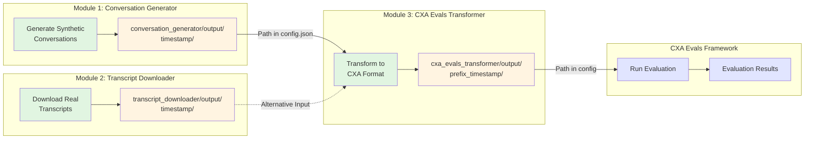

# Simulation Agent Evals

This repository contains tools for evaluating the SimulationAgent feature in Dynamics 365 Customer Service. It provides three modules for conversation generation, transcript downloading, and CXA Evals integration.

## Overall Workflow



## Modules

### 1. Conversation Generator
Generates synthetic conversations between customer and CSR agents using LLMs for testing and evaluation.

**[📖 View Documentation](conversation_generator/README.md)**

**Quick Start:**
```bash
cd conversation_generator
cp config.json.example config.json
# Edit config.json with your Azure OpenAI credentials
cd ..
python generate_conversations.py
```

**Personas Generator:**

Generate custom personas from natural language prompts:
```bash
python generate_personas.py --prompt "Your prompt describing the scenario"
# Creates: conversation_generator/personas/personas_YYYYMMDD_HHMMSS/
#   - personas.json (with embedded _metadata)
#   - _metadata.json
```

**Generate conversations from personas:**
```bash
# Edit config.json to point to your generated personas:
#   "persona_templates_path": "conversation_generator/personas/personas_YYYYMMDD_HHMMSS/personas.json"
python generate_conversations.py
# Creates: conversation_generator/personas/personas_YYYYMMDD_HHMMSS/conversations_YYYYMMDD_HHMMSS/
```

**[📖 View Personas Generator Documentation](conversation_generator/PERSONAS_GENERATOR.md)**

---

### 2. Transcript Downloader
Downloads conversation transcripts from Dynamics 365 Customer Service workstreams.

**[📖 View Documentation](transcript_downloader/README.md)**

**Quick Start:**
```bash
cd transcript_downloader
cp config.json.example config.json
# Edit config.json with your Dynamics 365 settings
cd ..
python download_transcripts.py
```

---

### 3. CXA Evals Transformer
Transforms conversation generator output into CXA Evals framework input format for agent performance evaluation.

**[📖 View Documentation](cxa_evals_transformer/README.md)**

**Quick Start:**
```bash
cd cxa_evals_transformer
cp config.json.example config.json
# Edit config.json with input/output paths
cd ..
python transform_for_cxa_evals.py
```

---

## Prerequisites

- **Python 3.9 or higher**
- **For Conversation Generator**: Azure OpenAI access
- **For Transcript Downloader**: Access to a Dynamics 365 Customer Service organization
- **For CXA Evals Transformer**: Generated conversations from conversation_generator

## Installation

1. Clone this repository

2. Install dependencies:
   ```bash
   pip install -r requirements.txt
   ```

3. Configure each module:
   ```bash
   # For each module you want to use
   cd <module_directory>
   cp config.json.example config.json
   # Edit config.json with your settings
   ```

## Configuration

Each module uses a `config.json` file for configuration:

- **Conversation Generator**: `conversation_generator/config.json`
- **Transcript Downloader**: `transcript_downloader/config.json`
- **CXA Evals Transformer**: `cxa_evals_transformer/config.json`

Copy the `.example` files to create your configuration files. See each module's README for detailed configuration options.

## Workflow

### End-to-End Evaluation Workflow

1. **Generate Conversations**:
   ```bash
   python generate_conversations.py
   ```
   Outputs: `conversation_generator/output/20241208_123456/`

2. **Transform for CXA Evals**:
   ```bash
   # Update cxa_evals_transformer/config.json with the output path
   python transform_for_cxa_evals.py
   ```
   Outputs: `cxa_evals_transformer/output/cxa_evals_output_20241208_123500/sa_multi_turn_conversations.json`

3. **Update CXA Evals config** with the transformed file path in `sa_custom_config_multi_turn.json`

4. **Run CXA Evals** (separate framework) with the transformed conversations

### Alternative: Download Real Transcripts

Instead of generating synthetic conversations, you can download real transcripts:

```bash
python download_transcripts.py
```
Outputs: `transcript_downloader/output/20241208_123456/`

## Project Structure

```
.
├── conversation_generator/       # Conversation generation module
│   ├── config.json              # Configuration (create from .example)
│   ├── config.json.example      # Example configuration
│   ├── knowledge_base/          # Knowledge base for CSR agent
│   ├── output/                  # Generated conversations
│   ├── personas.json            # Customer personas
│   └── README.md                # Module documentation
│
├── transcript_downloader/        # Transcript downloader module
│   ├── config.json              # Configuration (create from .example)
│   ├── config.json.example      # Example configuration
│   ├── output/                  # Downloaded transcripts
│   └── README.md                # Module documentation
│
├── cxa_evals_transformer/        # CXA Evals transformer module
│   ├── config.json              # Configuration (create from .example)
│   ├── config.json.example      # Example configuration
│   ├── output/                  # Timestamped transformed outputs
│   │   └── cxa_evals_output_YYYYMMDD_HHMMSS/
│   ├── cxa-evals/               # CXA Evals files
│   │   ├── output/              # CXA Evals evaluation results
│   │   └── sa_custom_config_multi_turn.json
│   └── README.md                # Module documentation
│
├── generate_conversations.py    # Conversation generator entry point
├── download_transcripts.py      # Transcript downloader entry point
├── transform_for_cxa_evals.py   # CXA Evals transformer entry point
├── requirements.txt             # Python dependencies
└── README.md                    # This file
```

## Documentation

For detailed documentation on each module:
- **[Conversation Generator Documentation](conversation_generator/README.md)**
- **[Transcript Downloader Documentation](transcript_downloader/README.md)**
- **[CXA Evals Transformer Documentation](cxa_evals_transformer/README.md)**

## Output

- **Conversation Generator**: Saves conversations to `conversation_generator/output/{timestamp}/`
- **Transcript Downloader**: Saves transcripts to `transcript_downloader/output/{timestamp}/`
- **CXA Evals Transformer**: Saves transformed conversations to `cxa_evals_transformer/output/{prefix}_{timestamp}/`

All modules organize output in timestamped folders for easy tracking and version control.

## License

This project is part of Microsoft's Dynamics 365 Customer Service development.

