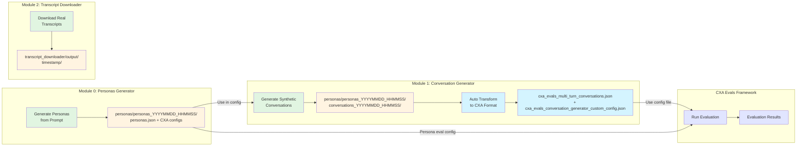

# Simulation Agent Evals

This repository contains tools for evaluating the SimulationAgent feature in Dynamics 365 Customer Service. It provides two modules for conversation generation and transcript downloading, with built-in CXA Evals integration.

## Overall Workflow



## Modules

### 1. Conversation Generator
Generates synthetic conversations between customer and CSR agents using LLMs for testing and evaluation.

**[📖 View Documentation](conversation_generator/README.md)**

**Quick Start:**
```bash
cd conversation_generator
cp config.json.example config.json
# Edit config.json with your Azure OpenAI credentials
cd ..
python generate_conversations.py
```

**Personas Generator:**

Generate custom personas from natural language prompts:
```bash
python generate_personas.py --prompt "Your prompt describing the scenario"
# Creates: conversation_generator/personas/personas_YYYYMMDD_HHMMSS/
#   - personas.json (with embedded _metadata)
#   - _metadata.json
```

**Generate conversations from personas:**
```bash
# Edit config.json to point to your generated personas:
#   "persona_templates_path": "conversation_generator/personas/personas_YYYYMMDD_HHMMSS/personas.json"
python generate_conversations.py
# Creates: conversation_generator/personas/personas_YYYYMMDD_HHMMSS/conversations_YYYYMMDD_HHMMSS/
#   - One conversation per persona
#   - Automatically transformed to CXA Evals format
#   - Includes CXA Evals config file with correct paths
```

**[📖 View Personas Generator Documentation](conversation_generator/PERSONAS_GENERATOR.md)**

---

### 2. Transcript Downloader
Downloads conversation transcripts from Dynamics 365 Customer Service workstreams.

**[📖 View Documentation](transcript_downloader/README.md)**

**Quick Start:**
```bash
cd transcript_downloader
cp config.json.example config.json
# Edit config.json with your Dynamics 365 settings
cd ..
python download_transcripts.py
```

---

## Prerequisites

- **Python 3.9 or higher**
- **For Conversation Generator**: Azure OpenAI access
- **For Transcript Downloader**: Access to a Dynamics 365 Customer Service organization

## Installation

1. Clone this repository

2. Install dependencies:
   ```bash
   pip install -r requirements.txt
   ```

3. Configure each module:
   ```bash
   # For each module you want to use
   cd <module_directory>
   cp config.json.example config.json
   # Edit config.json with your settings
   ```

## Configuration

Each module uses a `config.json` file for configuration:

- **Conversation Generator**: `conversation_generator/config.json`
- **Transcript Downloader**: `transcript_downloader/config.json`

Copy the `.example` files to create your configuration files. See each module's README for detailed configuration options.

CXA Evals configuration templates are automatically managed:
- **Conversation Evaluation**: `conversation_generator/cxa_evals/cxa_evals_conversation_generator_custom_config.json`
- **Persona Evaluation**: `conversation_generator/cxa_evals/cxa_evals_persona_generator_custom_config.json`

These templates are used to generate config files with correct paths in the output directories.

## Workflow

### End-to-End Evaluation Workflow

1. **Generate Personas** (optional, for custom scenarios):
   ```bash
   python generate_personas.py --prompt "Your scenario description"
   ```
   Outputs: `conversation_generator/personas/personas_20251209_140611/`
   - `personas.json` - Generated personas
   - `cxa_evals_personas.json` - Personas in CXA Evals format
   - `cxa_evals_persona_generator_custom_config.json` - CXA Evals config for evaluating persona generation
   - `cxa-evals-output/` - Directory for persona evaluation results

2. **Generate Conversations**:
   ```bash
   # Update conversation_generator/config.json with persona path:
   #   "persona_templates_path": "conversation_generator/personas/personas_20251209_140611/personas.json"
   python generate_conversations.py
   ```
   Outputs: `conversation_generator/personas/personas_20251209_140611/conversations_20251209_141530/`
   - Creates one conversation per persona
   - Automatically generates CXA Evals format: `cxa_evals_multi_turn_conversations.json`
   - Creates CXA Evals config: `cxa_evals_conversation_generator_custom_config.json`
   - Creates output directory: `cxa-evals-output/`

3. **Run CXA Evals** (using the generated configs):
   ```bash
   # Evaluate persona generation (optional)
   cd conversation_generator/personas/personas_20251209_140611/
   # Run CXA Evals framework with cxa_evals_persona_generator_custom_config.json
   
   # Evaluate conversations
   cd conversations_20251209_141530/
   # Run CXA Evals framework with cxa_evals_conversation_generator_custom_config.json
   ```

### Alternative: Download Real Transcripts

Instead of generating synthetic conversations, you can download real transcripts:

```bash
python download_transcripts.py
```
Outputs: `transcript_downloader/output/20241208_123456/`

## Project Structure

```
.
├── conversation_generator/       # Conversation generation module
│   ├── config.json              # Configuration (create from .example)
│   ├── config.json.example      # Example configuration
│   ├── cxa_evals/               # CXA Evals integration
│   │   ├── transformer.py       # CXA transformation logic
│   │   ├── models.py            # CXA data models
│   │   ├── cxa_evals_conversation_generator_custom_config.json  # Template
│   │   └── cxa_evals_persona_generator_custom_config.json       # Template
│   ├── knowledge_base/          # Knowledge base for CSR agent
│   │   ├── faq.json            # Generic customer support FAQ
│   │   ├── blooms-faq.json     # Flower delivery company FAQ
│   │   └── README.md           # Knowledge base documentation
│   ├── personas/                # Persona files
│   │   ├── examples/           # Example persona templates
│   │   │   └── personas.json
│   │   └── personas_YYYYMMDD_HHMMSS/  # Generated personas
│   │       ├── personas.json                                    # Personas
│   │       ├── cxa_evals_personas.json                          # CXA format
│   │       ├── cxa_evals_persona_generator_custom_config.json   # CXA config
│   │       ├── cxa-evals-output/                                # Eval results
│   │       └── conversations_YYYYMMDD_HHMMSS/                   # Conversations
│   │           ├── {conversation-id}.json
│   │           ├── cxa_evals_multi_turn_conversations.json
│   │           ├── cxa_evals_conversation_generator_custom_config.json
│   │           ├── cxa-evals-output/
│   │           └── _metadata.json
│   ├── output/                  # Output for example personas
│   ├── PERSONAS_GENERATOR.md    # Personas generator documentation
│   └── README.md                # Module documentation
│
├── transcript_downloader/        # Transcript downloader module
│   ├── config.json              # Configuration (create from .example)
│   ├── config.json.example      # Example configuration
│   ├── output/                  # Downloaded transcripts
│   └── README.md                # Module documentation
│
├── generate_personas.py         # Personas generator entry point
├── generate_conversations.py    # Conversation generator entry point
├── download_transcripts.py      # Transcript downloader entry point
├── requirements.txt             # Python dependencies
└── README.md                    # This file
```

## Documentation

For detailed documentation on each module:
- **[Conversation Generator Documentation](conversation_generator/README.md)**
- **[Transcript Downloader Documentation](transcript_downloader/README.md)**

## Output

- **Personas Generator**: Saves personas to `conversation_generator/personas/personas_{timestamp}/`
  - `personas.json` (with embedded `_metadata`)
  - `_metadata.json` (for backward compatibility)
  - `cxa_evals_personas.json` (CXA Evals format for persona evaluation)
  - `cxa_evals_persona_generator_custom_config.json` (CXA Evals config)
  - `cxa-evals-output/` directory (for persona evaluation results)
- **Conversation Generator**: 
  - For generated personas: Saves to `conversation_generator/personas/personas_{timestamp}/conversations_{timestamp}/`
    - Individual conversation JSON files (one per persona)
    - `_metadata.json` file
    - `cxa_evals_multi_turn_conversations.json` (CXA Evals format)
    - `cxa_evals_conversation_generator_custom_config.json` (CXA Evals config)
    - `cxa-evals-output/` directory (for evaluation results)
  - For example personas: Saves to `conversation_generator/output/{timestamp}/` (same structure as above)
- **Transcript Downloader**: Saves transcripts to `transcript_downloader/output/{timestamp}/`

All modules organize output in timestamped folders for easy tracking and version control.

## License

This project is part of Microsoft's Dynamics 365 Customer Service development.

