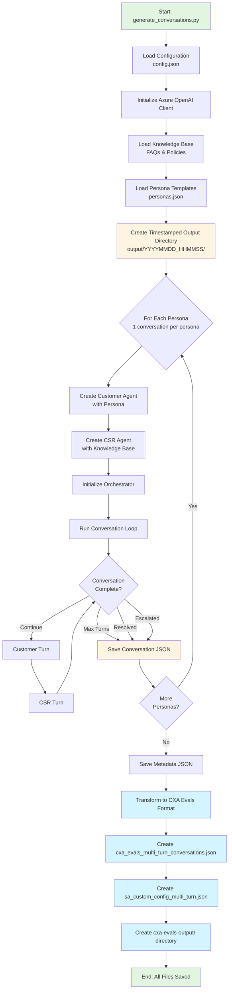

# Conversation Generator

Generates synthetic conversations between a customer agent and a CSR (Customer Service Representative) agent using LLMs. This tool creates realistic conversation datasets for testing and evaluating the SimulationAgent feature.

## Flow Diagram



## Overview

The conversation generator uses a **Two-LLM Framework**:
- **Customer Agent**: Simulates a customer with a specific persona (e.g., frustrated, confused, urgent)
- **CSR Agent**: Simulates a customer service representative with access to a knowledge base
- **Orchestrator**: Manages turn-taking, tracks conversation state, and handles termination

## Usage

```bash
python generate_conversations.py
```

## Prerequisites

- Python 3.9 or higher
- Azure AI Foundry project access with AAD authentication

## Installation

From the repository root:

```bash
pip install -r requirements.txt
```

## Configuration

All settings are configured via a `config.json` file in the `conversation_generator` directory.

### Quick Start

```bash
# Navigate to conversation_generator directory
cd conversation_generator

# Copy the example config file
cp config.json.example config.json

# Edit config.json with your Azure AI Project endpoint
# "azure_ai_project_endpoint": "https://your-resource.services.ai.azure.com/api/projects/your-project"

# Authenticate with Azure
cd ..
az login

# Run the generator (from repository root)
python generate_conversations.py
```

## Authentication

The Conversation Generator supports **two authentication methods** for Azure OpenAI:

### Option 1: AAD (Azure Active Directory) Authentication (Recommended)

Use this for Azure AI Foundry projects with managed identity or Azure AD authentication.

**Required Configuration:**

| Field | Description |
|-------|-------------|
| `azure_ai_project_endpoint` | Azure AI Project endpoint URL (e.g., https://your-resource.services.ai.azure.com/api/projects/your-project) |

**Authentication Setup:**

`DefaultAzureCredential` supports multiple authentication methods (in order of precedence):
1. **Environment variables** - Set `AZURE_CLIENT_ID`, `AZURE_TENANT_ID`, `AZURE_CLIENT_SECRET`
2. **Managed Identity** - Automatically used when running in Azure (App Service, Functions, etc.)
3. **Azure CLI** - Run `az login` (recommended for local development)
4. **Azure PowerShell** - Run `Connect-AzAccount`
5. **Interactive browser** - Opens browser for authentication if other methods fail

For local development, use Azure CLI:
```bash
az login
```

For more details, see [Azure Identity documentation](https://learn.microsoft.com/python/api/azure-identity/azure.identity.defaultazurecredential).

### Option 2: API Key Authentication

Use this for direct Azure OpenAI resource access with API keys.

**Required Configuration:**

| Field | Description |
|-------|-------------|
| `azure_openai_api_key` | Your Azure OpenAI API key |
| `azure_openai_endpoint` | Azure OpenAI endpoint URL (e.g., https://your-resource.openai.azure.com/) |

**Example config.json for API Key Authentication:**
```json
{
  "azure_openai_api_key": "your-api-key-here",
  "azure_openai_endpoint": "https://your-resource.openai.azure.com/",
  "azure_openai_api_version": "2024-02-01",
  "customer_deployment": "gpt-4o-mini",
  "csr_deployment": "gpt-4o-mini"
}
```

**Note:** You must configure **exactly one** authentication method. The configuration will be validated on startup.

## Optional Configuration

| Field | Default | Description |
|-------|---------|-------------|
| `azure_openai_api_version` | `2024-02-01` | Azure OpenAI API version |
| `customer_deployment` | `gpt-4o-mini` | Deployment name for customer agent |
| `csr_deployment` | `gpt-4o-mini` | Deployment name for CSR agent |
| `max_turns` | `20` | Maximum conversation turns |
| `temperature` | `0.7` | LLM temperature (0.0-2.0) |
| `max_tokens` | `500` | Maximum tokens per response |
| `knowledge_base_path` | `conversation_generator/knowledge_base/` | Path to knowledge base files |
| `output_dir` | `conversation_generator/output/` | Output directory for conversations (used when personas are from examples folder) |
| `persona_templates_path` | `conversation_generator/personas/examples/personas.json` | Path to persona templates file |

**Note**: The generator creates **one conversation per persona**. The number of personas in your personas file determines how many conversations will be generated. When using personas generated by `personas_generator` (e.g., from `conversation_generator/personas/personas_YYYYMMDD_HHMMSS/`), conversations are automatically saved inside that personas folder as `conversations_YYYYMMDD_HHMMSS/`, coupling the conversations with their source personas. When using personas from the examples folder, conversations are saved to the `output_dir` as before.

## How It Works

1. **Initialize Agents**: Creates customer and CSR agents with LLM clients
2. **Load Knowledge**: Loads knowledge base (FAQs, policies) for CSR agent
3. **Load Personas**: Loads customer persona templates (frustrated, confused, etc.)
4. **Generate Conversations**: For each persona (one conversation per persona):
   - Customer starts with an initial message based on persona
   - CSR responds using knowledge base
   - Turns continue until resolved, escalated, or max turns reached
5. **Save Results**: Conversations saved as JSON files with metadata
6. **Transform to CXA Evals**: Automatically transforms conversations to CXA Evals format
   - Creates `cxa_evals_multi_turn_conversations.json` for CXA Evals framework
   - Generates `sa_custom_config_multi_turn.json` config file with correct paths
   - Creates `cxa-evals-output/` directory for evaluation results

## Components

### Personas

Built-in personas include:
- Frustrated Refund Seeker
- Confused First-Time User
- Urgent Shipping Issue
- Technical Support Needed
- Price Match Request
- Account Access Problem
- Product Information Seeker
- Warranty Claim
- Billing Discrepancy
- Highly Satisfied Customer

Example personas are available in `conversation_generator/personas/examples/personas.json`.

**Generate Custom Personas:**

You can generate custom personas from natural language prompts using the Personas Generator:

```bash
python generate_personas.py --prompt "Your scenario description"
```

See [PERSONAS_GENERATOR.md](PERSONAS_GENERATOR.md) for detailed documentation.

### Knowledge Base

The CSR agent uses a knowledge base to answer questions. Available knowledge bases:

- **Generic FAQ** (`conversation_generator/knowledge_base/faq.json`): General customer support topics including returns, shipping, account management, product warranties, billing, and technical support.

- **Flower Delivery FAQ** (`conversation_generator/knowledge_base/blooms-faq.json`): Specialized FAQ for flower delivery companies, covering delivery options, freshness, customization, occasions, subscriptions, and more.

You can:
- Use a single FAQ file: `"knowledge_base_path": "conversation_generator/knowledge_base/blooms-faq.json"`
- Load all FAQ files from directory: `"knowledge_base_path": "conversation_generator/knowledge_base/"`
- Create custom FAQ files following the structure in existing files

See [knowledge_base/README.md](knowledge_base/README.md) for details on the FAQ file format and creating custom knowledge bases.

### Conversation Termination

Conversations end when:
- **Resolved**: Customer expresses satisfaction (detected via keywords like "thank you", "perfect")
- **Escalated**: CSR transfers to supervisor (detected in CSR response)
- **Max Turns**: Conversation reaches maximum turn limit
- **Error**: An error occurs during generation

## Output Format

Each conversation is saved as a JSON file with this structure:

```json
{
  "conversation_id": "uuid",
  "messages": [
    {
      "role": "customer",
      "content": "message text",
      "timestamp": "ISO-8601 timestamp",
      "metadata": {}
    }
  ],
  "status": "resolved|escalated|failed",
  "turn_count": 10,
  "persona": "Frustrated Refund Seeker",
  "resolution_reason": "Issue resolved",
  "created_at": "ISO-8601 timestamp",
  "ended_at": "ISO-8601 timestamp",
  "metadata": {
    "persona_description": "...",
    "persona_goal": "...",
    "persona_tone": "...",
    "persona_complexity": "medium"
  }
}
```

### Output Folder Structure

Conversations are organized by timestamp. The output location depends on the source of personas:

**When using generated personas** (from `personas_generator`):
```
conversation_generator/personas/personas_YYYYMMDD_HHMMSS/
├── personas.json
├── _metadata.json
├── cxa_evals_personas.json                               # CXA Evals format
├── cxa_evals_persona_generator_custom_config.json        # CXA Evals config
├── cxa-evals-output/                                     # Persona eval results
└── conversations_YYYYMMDD_HHMMSS/
    ├── {conversation-id-1}.json
    ├── {conversation-id-2}.json
    ├── ...
    ├── _metadata.json
    ├── cxa_evals_multi_turn_conversations.json           # CXA Evals format
    ├── cxa_evals_conversation_generator_custom_config.json  # CXA Evals config
    └── cxa-evals-output/                                 # Conversation eval results
```

**When using example personas** (from `personas/examples/`):
```
conversation_generator/output/YYYYMMDD_HHMMSS/
├── {conversation-id-1}.json
├── {conversation-id-2}.json
├── ...
├── _metadata.json
├── cxa_evals_multi_turn_conversations.json               # CXA Evals format
├── cxa_evals_conversation_generator_custom_config.json   # CXA Evals config
└── cxa-evals-output/                                     # Conversation eval results
```

The `_metadata.json` file contains generation settings and summary information. The `cxa_evals_*` files are ready for use with the CXA Evals framework for evaluating both persona generation and conversation quality.

## Module Structure

```
conversation_generator/
├── __init__.py              # Package initialization
├── models.py                # Data models (Message, ConversationState, PersonaTemplate)
├── config.py                # Configuration settings
├── config_schema.py         # Configuration validation schema
├── knowledge_base.py        # Knowledge base handler
├── agents.py                # Customer and CSR agent implementations
├── orchestrator.py          # Conversation orchestrator
├── personas_generator.py    # Personas generator module
├── knowledge_base/          # Knowledge base files
│   ├── faq.json            # Generic customer support FAQ
│   ├── blooms-faq.json     # Flower delivery FAQ
│   └── README.md           # Knowledge base documentation
├── personas/                # Persona files
│   ├── examples/           # Example persona templates
│   │   └── personas.json
│   └── personas_YYYYMMDD_HHMMSS/  # Generated personas (created by personas_generator)
├── output/                  # Output for conversations using example personas
├── README.md               # This file
└── PERSONAS_GENERATOR.md   # Personas generator documentation
```

## Customization

### Adding Custom Personas

You have two options:

1. **Use Personas Generator** (Recommended):
   ```bash
   python generate_personas.py --prompt "Your scenario description"
   ```
   See [PERSONAS_GENERATOR.md](PERSONAS_GENERATOR.md) for details.

2. **Manually Edit Personas Files**:
   
   Edit `conversation_generator/personas/examples/personas.json` or create a new file:
   
   ```json
   {
     "personas": [
       {
         "name": "Your Persona Name",
         "description": "Detailed situation description",
         "goal": "What the customer wants to achieve",
         "tone": "Expected tone/emotion",
         "complexity": "simple|medium|complex"
       }
     ]
   }
   ```

### Extending Knowledge Base

Add a new FAQ file to `conversation_generator/knowledge_base/`:

```json
{
  "_note": "This is TEST DATA ONLY. Update with actual business information before production use.",
  "items": [
    {
      "category": "category_name",
      "question": "Question or topic",
      "answer": "Answer or information",
      "tags": ["tag1", "tag2"]
    }
  ]
}
```

See [knowledge_base/README.md](knowledge_base/README.md) for more details.

### Using Azure OpenAI

Set these environment variables in your `.env` file:

```bash
CG_AZURE_OPENAI_API_KEY=your-azure-api-key
CG_AZURE_OPENAI_ENDPOINT=https://your-resource.cognitiveservices.azure.com/
CG_AZURE_OPENAI_API_VERSION=2024-02-01
CG_CUSTOMER_DEPLOYMENT=gpt-4o-mini
CG_CSR_DEPLOYMENT=gpt-4o-mini
```

**Note:** The deployment names (`CG_CUSTOMER_DEPLOYMENT` and `CG_CSR_DEPLOYMENT`) must match the deployment names you created in your Azure OpenAI resource.

## Example

See `example_usage.py` in the repository root for a demonstration of the framework components without requiring an API key.

```bash
python example_usage.py
```

## Troubleshooting

### Azure OpenAI API Errors

- Verify your API key is correct and active
- Check your Azure OpenAI resource is properly deployed
- Ensure the deployment names match your Azure OpenAI deployments
- Verify the endpoint URL is correct (should end with `.cognitiveservices.azure.com/`)

### No Conversations Generated

- Check that persona templates loaded correctly
- Verify knowledge base is accessible
- Review error messages in console output

### Poor Quality Conversations

- Adjust temperature (lower = more consistent, higher = more creative)
- Modify persona descriptions to be more specific
- Enhance knowledge base with more detailed information
- Increase max_tokens if responses are being cut off
