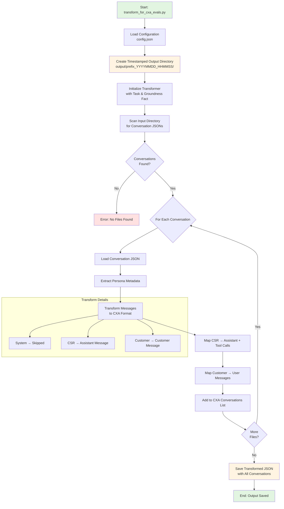

# CXA Evals Transformer

This module transforms conversation generator output into the format required by the CXA Evals framework for agent performance evaluation.

## Flow Diagram



## Overview

The CXA Evals Transformer bridges the gap between the `conversation_generator` module and the CXA Evals framework. It converts synthetic conversations into the multi-turn conversation format expected by CXA Evals, allowing you to evaluate agent performance using the generated conversations.

**Note**: The transformer now creates timestamped output directories under `cxa_evals_transformer/output/` for better organization, similar to the conversation_generator module.

## Features

- ✅ Transforms conversation generator output to CXA Evals format
- ✅ Supports multi-turn conversation structure
- ✅ Maps customer/CSR roles to CXA message format (role and content only)
- ✅ Preserves persona metadata for customer evaluation
- ✅ Fixed scenario name "SimulationAgent" for consistency
- ✅ Batch processing of multiple conversations

## Configuration

The transformer is configured via `config.json` file. Copy the example file to get started:

```bash
cd cxa_evals_transformer
cp config.json.example config.json
# Edit config.json with your settings
```

### Configuration Options

| Field | Type | Required | Description |
|-------|------|----------|-------------|
| `input_dir` | string | Yes | Directory containing conversation generator output files |
| `output_folder_prefix` | string | No | Prefix for timestamped output folders (default: "cxa_evals_output_") |
| `output_file` | string | No | Output filename for transformed conversations (default: "sa_multi_turn_conversations.json") |
| `scenario_name` | string | No | **DEPRECATED** - Ignored. All conversations use "SimulationAgent" |
| `task` | string | No | Task description for the agent (default: "Customer Support") |
| `groundness_fact` | string | No | Default groundness fact for conversations (default: "") |
| `cxa_evals_dir` | string | No | Directory for CXA Evals related files (default: "cxa_evals_transformer/cxa-evals/") |

### Example config.json

```json
{
  "input_dir": "conversation_generator/output/20241208_123456/",
  "output_folder_prefix": "cxa_evals_output_",
  "output_file": "sa_multi_turn_conversations.json",
  "scenario_name": "customer_support",
  "task": "Customer Support",
  "groundness_fact": "Knowledge base contains FAQ for customer support.",
  "cxa_evals_dir": "cxa_evals_transformer/cxa-evals/"
}
```

**Note**: The transformer creates a timestamped directory like `cxa_evals_transformer/output/cxa_evals_output_20241208_123456/` and saves the output file inside it.

## Usage

### Basic Usage

1. **Generate conversations** using the conversation_generator module:
   ```bash
   python generate_conversations.py
   ```
   This creates output in: `conversation_generator/output/20241208_123456/`

2. **Update config.json** with the path to generated conversations:
   ```json
   {
     "input_dir": "conversation_generator/output/20241208_123456/"
   }
   ```

3. **Run the transformer**:
   ```bash
   python transform_for_cxa_evals.py
   ```
   This creates output in: `cxa_evals_transformer/output/cxa_evals_output_20241208_123500/sa_multi_turn_conversations.json`

### Output Format

The transformer creates a JSON file in the CXA Evals format:

```json
{
  "conversations": [
    {
      "Id": "conv1",
      "scenario_name": "SimulationAgent",
      "conversation": [
        {
          "role": "Assistant",
          "content": "Hello! How can I help you today?"
        },
        {
          "role": "Customer",
          "content": "I need help with my account"
        }
      ],
      "groundness_fact": "Knowledge base contains FAQ for customer support.",
      "task": "Customer Support",
      "persona_name": "Account Access Problem",
      "persona_description": "A customer who cannot access their account...",
      "persona_goal": "Regain access to their account securely",
      "persona_tone": "worried and cautious",
      "persona_complexity": "medium"
    }
  ]
}
```

**Note**: All conversations use `"scenario_name": "SimulationAgent"` regardless of configuration.

## Transformation Details

### Role Mapping

| Generator Role | CXA Evals Format |
|----------------|------------------|
| `csr` | `Assistant` message with content |
| `customer` | `Customer` message |
| `system` | Skipped (not included in output) |

## Integration with CXA Evals

After transformation, use the output file with the CXA Evals framework:

1. **Locate the transformed file**:
   - Example: `cxa_evals_transformer/output/cxa_evals_output_20241208_123500/sa_multi_turn_conversations.json`

2. **Update CXA Evals config** (`sa_custom_config_multi_turn.json`) to point to this file:
   ```json
   {
     "source": {
       "source_folder_path": ".\\data\\cxa_evals_transformer\\output\\cxa_evals_output_20241208_123500\\sa_multi_turn_conversations.json"
     }
   }
   ```
   
   **Important Notes**:
   - Replace `cxa_evals_output_20241208_123500` with the actual timestamped directory name from your transformer run
   - The path in `sa_custom_config_multi_turn.json` uses Windows-style backslashes (`\`). Adjust for your platform if needed.
   - The `.\\data\\` prefix is relative to where the CXA Evals CLI is executed. Adjust the path based on your working directory.

3. **Run CXA Evals** with the configuration file.

## Directory Structure

```
cxa_evals_transformer/
├── __init__.py              # Package initialization
├── config.py                # Configuration loader
├── config.json              # Configuration file (create from .example)
├── config.json.example      # Example configuration
├── config_schema.py         # Pydantic schema for validation
├── models.py                # Data models for CXA format
├── transformer.py           # Transformation logic
├── README.md               # This file
├── output/                 # Timestamped output directories
│   └── cxa_evals_output_YYYYMMDD_HHMMSS/
│       └── sa_multi_turn_conversations.json
└── cxa-evals/              # CXA Evals related files
    ├── output/             # CXA Evals evaluation outputs
    ├── example_custom_config_multi_turn.json
    └── sa_custom_config_multi_turn.json
```

## Error Handling

The transformer includes validation and error handling:

- **Missing config file**: Provides clear error message with instructions
- **Invalid JSON**: Reports parsing errors with line numbers
- **Missing input directory**: Checks directory existence before processing
- **Invalid conversation format**: Skips malformed files with warnings
- **Schema validation**: Validates configuration against Pydantic schema

## Troubleshooting

### "Configuration file not found"

Create a `config.json` file:
```bash
cp config.json.example config.json
```

### "No conversation files found"

- Verify the `input_dir` path in config.json
- Ensure you've run the conversation generator first
- Check that the directory contains JSON files

### "Invalid conversation format"

- Verify conversations were generated by the conversation_generator module
- Check that JSON files are not corrupted
- Review transformer warnings for specific file errors

## Advanced Usage

### Scenario Name

**Note**: As of the latest version, all conversations use `"scenario_name": "SimulationAgent"` by default. The `scenario_name` configuration parameter is deprecated and ignored. This ensures consistency across all CXA Evals evaluations.

### Groundness Facts

Add domain-specific facts for evaluation:

```json
{
  "groundness_fact": "Password reset requires email verification and 2FA."
}
```

### Batch Processing

Transform multiple conversation batches by updating `input_dir`:

```bash
# Transform batch 1
# Update config.json: "input_dir": "conversation_generator/output/20241208_120000/"
python transform_for_cxa_evals.py
# Creates: cxa_evals_transformer/output/cxa_evals_output_20241208_120100/

# Transform batch 2
# Update config.json: "input_dir": "conversation_generator/output/20241208_130000/"
python transform_for_cxa_evals.py
# Creates: cxa_evals_transformer/output/cxa_evals_output_20241208_130100/
```

Each run creates a new timestamped output directory, preserving all previous transformations.

## API Reference

### CXAEvalsTransformer

Main transformer class.

**Methods:**

- `transform_conversation(conversation_data: Dict[str, Any]) -> CXAConversation`
  - Transforms a single conversation
  
- `transform_directory(input_dir: str, output_file: str, pattern: str = "*.json") -> int`
  - Transforms all conversations in a directory
  - Returns: Number of conversations transformed

### Configuration Schema

See `config_schema.py` for the complete Pydantic schema definition.

## License

This project is part of Microsoft's Dynamics 365 Customer Service development.
