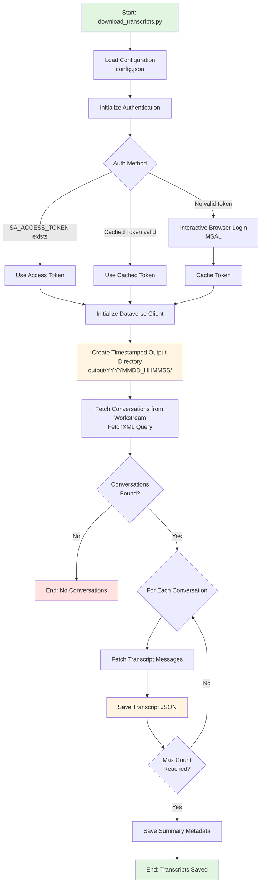

# Transcript Downloader

Downloads conversation transcripts from Dynamics 365 Customer Service workstreams.

## Flow Diagram



## Usage

```bash
python download_transcripts.py
```

## Prerequisites

- Python 3.9 or higher
- Access to a Dynamics 365 Customer Service organization
- An account with permissions to read conversations and transcripts

## Installation

From the repository root:

```bash
pip install -r requirements.txt
```

## Configuration

All settings are configured via a `config.json` file in the `transcript_downloader` directory.

### Quick Start

```bash
# Navigate to transcript_downloader directory
cd transcript_downloader

# Copy the example config file
cp config.json.example config.json

# Edit config.json with your values
# "organization_url": "https://yourorg.crm.dynamics.com"
# "tenant_id": "your-tenant-id-guid"
# "workstream_id": "your-workstream-id-guid"
# "max_conversations": 100

# Run the script (from repository root)
cd ..
python download_transcripts.py
```

## Required Configuration

The following fields are **required** in `config.json`:

| Field | Description |
|-------|-------------|
| `organization_url` | Your Dynamics 365 organization URL (e.g., `https://yourorg.crm.dynamics.com`) |
| `tenant_id` | Your Azure AD tenant ID (GUID format) |
| `workstream_id` | The workstream ID to fetch conversations from (GUID format) |
| `max_conversations` | Maximum number of conversations to download (range: 1-1000) |

## Optional Configuration

| Field | Default | Description |
|-------|---------|-------------|
| `access_token` | (empty) | Access token to bypass interactive login |
| `login_hint` | (empty) | Email hint for authentication |
| `days_to_fetch` | `7` | Number of days to look back |
| `client_id` | `51f81489-12ee-4a9e-aaae-a2591f45987d` | Azure AD client ID |
| `api_version` | `v9.2` | Dataverse API version |
| `page_size` | `50` | Batch size for pagination |
| `max_content_size` | `52428800` | Maximum base64 content size (50MB) |
| `token_cache_path` | `.token_cache.json` | Path to token cache file |
| `output_dir` | `transcript_downloader/output/` | Output directory for transcripts |

## Example config.json

```json
{
  "organization_url": "https://yourorg.crm.dynamics.com",
  "tenant_id": "12345678-1234-1234-1234-123456789012",
  "workstream_id": "87654321-4321-4321-4321-210987654321",
  "max_conversations": 100,
  "login_hint": "user@yourdomain.com",
  "days_to_fetch": 7
}
```

## Authentication

The script supports multiple authentication methods with the following priority order:

1. **Environment Variable Token**: If `SA_ACCESS_TOKEN` is set and valid, it will be used directly
2. **File-based Token Cache**: If a valid cached token exists in `.token_cache.json`, it will be used
3. **Interactive Browser Authentication**: Opens a browser window for login via MSAL

### Token Caching

Tokens are automatically cached to `.token_cache.json` after successful interactive authentication. This allows subsequent runs to skip the browser login. The cache file is automatically excluded from git via `.gitignore`.

To clear the cached token, simply delete the `.token_cache.json` file or set a new `SA_ACCESS_TOKEN` environment variable.

### Direct Token Authentication

For automation scenarios or when you already have a valid access token, you can set the `SA_ACCESS_TOKEN` environment variable:

```bash
export SA_ACCESS_TOKEN="your-access-token-here"
python download_transcripts.py
```

Or add it to your `.env` file:

```
SA_ACCESS_TOKEN=your-access-token-here
```

## Output

Transcripts are saved as JSON files using the conversation ID as the filename:

```
{conversation_id}.json
```

### Output Folder Structure

By default, transcripts are organized by timestamp in:

```
output/transcripts/{timestamp}/
```

Where `{timestamp}` is in the format `YYYYMMDD_HHMMSS` (e.g., `20231215_143022`).

Each run creates a new timestamped folder, preserving the history of all downloads automatically.

## Module Structure

```
transcript_downloader/
├── __init__.py              # Package initialization
├── config.py                # Configuration settings
├── auth.py                  # Authentication module (MSAL)
├── dataverse_client.py      # Dataverse Web API client
├── models.py                # Data models (Conversation, Transcript, Annotation, DownloadSummary)
├── transcript_downloader.py # Main transcript download logic
└── validators.py            # Input validation utilities
```

## Data Models

The package uses typed dataclasses for better type safety and IDE support:

- **`Conversation`** - Represents a D365 live work item with id, title, created_on
- **`Transcript`** - Represents a transcript record with id, name, created_on
- **`Annotation`** - Represents an annotation with id, document_body, filename, mimetype
- **`DownloadSummary`** - Summary of download operation with counts and file list

## How It Works

1. **Authentication**: Uses MSAL to authenticate with Azure AD and get an access token for Dynamics 365
2. **Fetch Conversations**: Queries the `msdyn_ocliveworkitem` table for conversations in the specified workstream
3. **Fetch Transcripts**: For each conversation, queries the `msdyn_transcript` table
4. **Fetch Annotations**: Retrieves the `annotation` record containing the transcript content
5. **Decode & Save**: Decodes the base64-encoded document body and saves it as a formatted JSON file

## Troubleshooting

### Authentication Errors

- Ensure you have the correct tenant ID
- Verify your account has access to the Dynamics 365 organization
- Check that the organization URL is correct

### No Transcripts Found

- Verify the workstream ID is correct
- Ensure there are conversations with transcripts in the specified time range
- Check that transcripts exist in the system for the conversations

### Permission Errors

- Your account needs read access to:
  - `msdyn_ocliveworkitem` (Conversations)
  - `msdyn_transcript` (Transcripts)
  - `annotation` (Notes/Attachments)
